# PocAndroidAnimJetpackCompose

Dans ce projet j'explore comment effectuer des animations sur jetpack Compose.

## Home Page

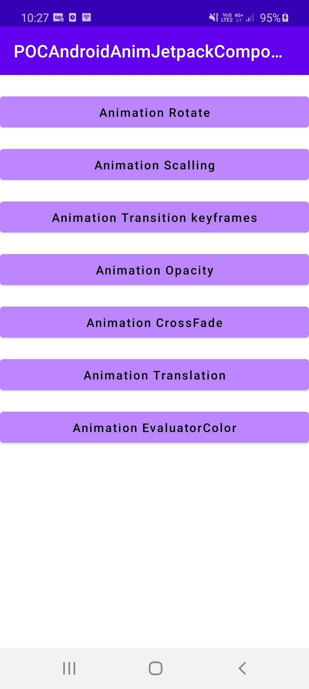

## Rotate


Cette animation va nous permettre de faire faire une rotation à notre objet.

Pour cela dans un premier temps on défini l'état de depart de notre objet, son état d'arrivé, et la transition entre ces deux états.
```kotlin
    enum class Rotation {
        First,Second
    }

    val rotation = FloatPropKey()

    val definitionRotation = transitionDefinition {
        state(Rotation.First) {
            this[rotation] = 0f
        }
        state(Rotation.Second) {
            this[rotation] = 360f
        }
        transition(fromState = Rotation.First, toState = Rotation.Second) {
            rotation using repeatable {
                animation = tween {
                    easing = FastOutLinearInEasing
                    duration = 2000
                }
                iterations = 1
            }
        }
    }
```

Ensuite je déclare une variable "animation" qui a pour état "false".
```kotlin
val animation = state { false }
```

Lorsque cette variable passe à "true" notre objet va passer de notre état 1 à notre état 2.
```kotlin
    @Composable
    fun Rotate() {
        val animation = state { false }

        Surface(color = Color.White, modifier = Modifier.fillMaxHeight().fillMaxWidth()) {
            Column(
                    modifier = Modifier
                        .fillMaxHeight()
                        .fillMaxWidth()
                        .padding(bottom = 100.dp, start = 16.dp, top = 16.dp, end = 16.dp),
                    horizontalGravity = Alignment.CenterHorizontally,
                    verticalArrangement = Arrangement.Bottom
            ) {
                Transition(definition = definitionRotation,
                        initState = Rotation.First,
                        toState = if (!animation.value) {
                            Rotation.First
                        } else {
                            Rotation.Second
                        }
                ) { state ->
                    Canvas(
                            modifier = Modifier.preferredSize(100.dp).clickable(onClick = { animation.value = true })
                    ) {
                        rotate(state[rotation]) {
                            drawRect(color = purple200)
                        }
                    }
                }
            }
        }
    }
```

## Scalling

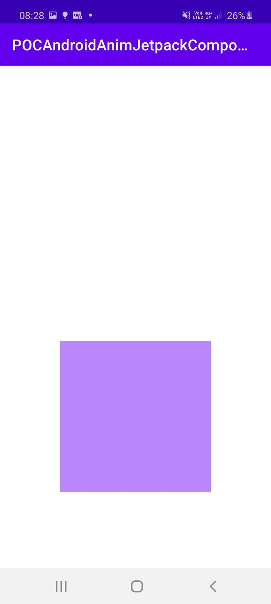

Cette animation va nous permettre de doubler la taille de notre objet.

Pour cela je déclare une variable "animation" qui a pour état "false".
```kotlin
val animation = state { false }
```

On défini ensuite l'animation dans une variable "height".
```kotlin
val height : Dp = animate(if (animation.value) 200.dp else 100.dp)
```

Lorsque notre variable "animation" passe à l'état "true", l'animation se déclenche.
```kotlin
    @Composable
    fun Scalling() {
        val animation = state { false }

        Surface(color = Color.White, modifier = Modifier.fillMaxHeight().fillMaxWidth()) {
            Column(
                    modifier = Modifier
                        .fillMaxHeight()
                        .fillMaxWidth()
                        .padding(bottom = 100.dp, start = 16.dp, top = 16.dp, end = 16.dp),
                    horizontalGravity = Alignment.CenterHorizontally,
                    verticalArrangement = Arrangement.Bottom
            ) {
                val height : Dp = animate(if (animation.value) 200.dp else 100.dp)
                Canvas(
                    modifier = Modifier
                        .preferredSize(height)
                        .clickable(onClick = { animation.value = animation.value != true })
                ) {
                    drawRect(color = purple200)
                }
            }
        }
    }
```

## Transitions keyframes

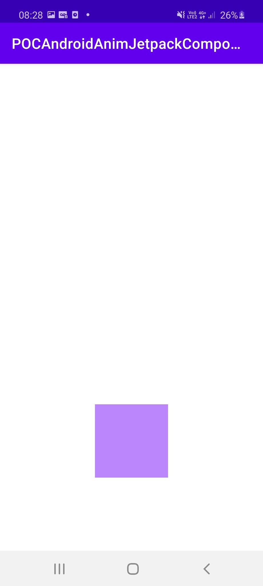
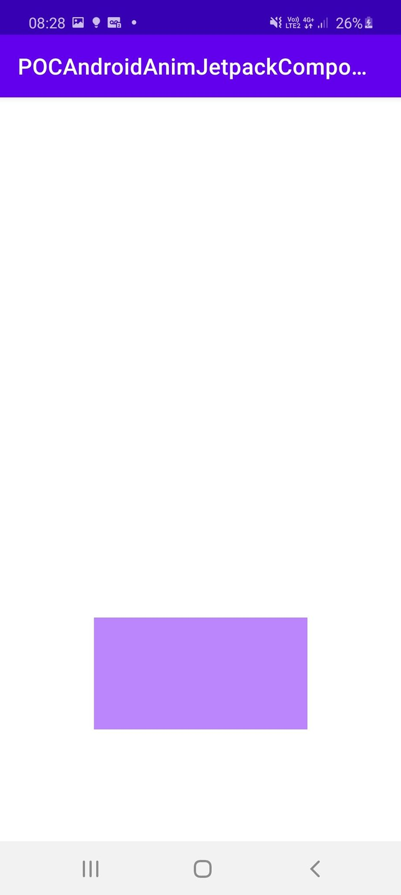

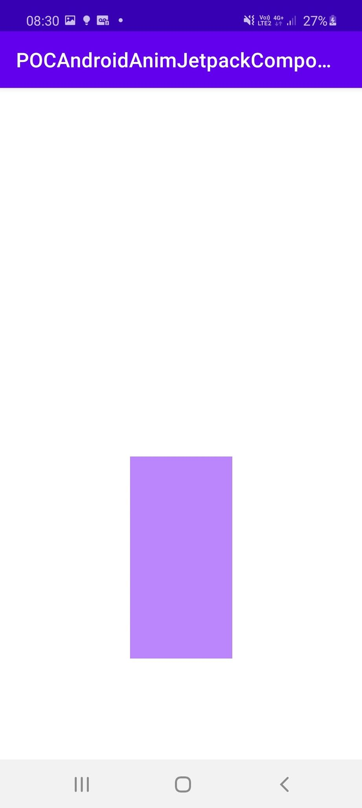


Comme pour la rotation nous allons définir l'état de depart de notre objet, son état d'arrivé, et la transition entre ces deux états.
Mais nous allons segmenter l'animation en utilisant "keyframes".
```kotlin
    enum class FewAnimation {
        First,Second
    }

    val widthKey = DpPropKey()
    val heightKey = DpPropKey()

    val definitionFewAnimations = transitionDefinition {
        state(FewAnimation.First) {
            this[widthKey] = 100.dp
            this[heightKey] = 100.dp
        }
        state(FewAnimation.Second) {
            this[widthKey] = 100.dp
            this[heightKey] = 100.dp
        }
        transition(fromState = FewAnimation.First, toState = FewAnimation.Second) {
            heightKey using keyframes {
                duration = 4000
                100.dp at 1000
                200.dp at 2000
                200.dp at 3000
                100.dp at 4000
            }
            widthKey using keyframes {
                duration = 4000
                200.dp at 1000
                200.dp at 2000
                100.dp at 3000
                100.dp at 4000
            }
            interruptionHandling = InterruptionHandling.UNINTERRUPTIBLE
        }
    }
```
Ensuite je déclare une variable "animation" qui a pour état "false".
```kotlin
val animation = state { false }
```

Lorsque cette variable passe à "true" notre objet va passer de notre état 1 à notre état 2.
```kotlin
    @Composable
    fun TransitionKeyframes() {
        val animation = state { false }

        Surface(color = Color.White, modifier = Modifier.fillMaxHeight().fillMaxWidth()) {
            Column(
                modifier = Modifier
                    .fillMaxHeight()
                    .fillMaxWidth()
                    .padding(bottom = 100.dp, start = 16.dp, top = 16.dp, end = 16.dp),
                horizontalGravity = Alignment.CenterHorizontally,
                verticalArrangement = Arrangement.Bottom
            ) {
                Transition(definition = definitionFewAnimations,
                    initState = FewAnimation.First,
                    toState = if (!animation.value) {
                        FewAnimation.First
                    } else {
                        FewAnimation.Second
                    }
                ) { state ->
                    Canvas(
                        modifier = Modifier
                            .preferredSize(state[widthKey], state[heightKey])
                            .clickable(onClick = { animation.value = true })
                    ) {
                        drawRect(color = purple200)
                    }
                }
            }
        }
    }
```

## Animation Opacity

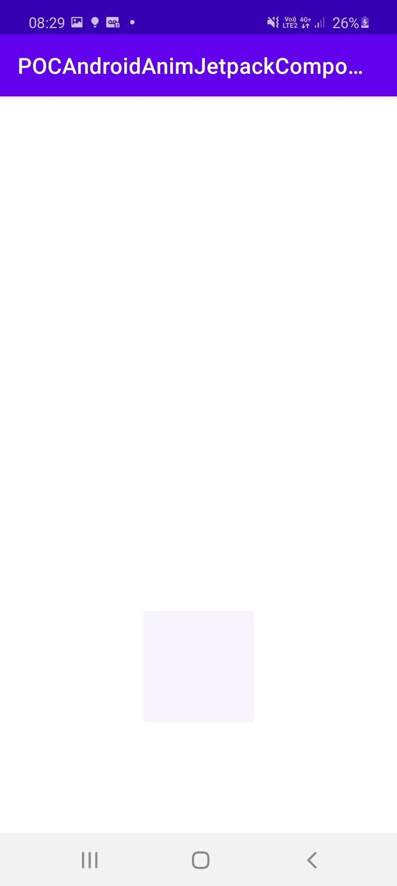

Cette animation va nous permettre de réduire l'opacité de notre objet, dans le but de le rendre transparent ou de le faire disparaitre.

Pour cela je déclare une variable "animation" qui a pour état "false".
```kotlin
val animation = state { false }
```

On défini ensuite l'animation dans une variable "opacity".
```kotlin
val opacity = animate(if (animation.value) 0.1f else 1f)
```

Lorsque notre variable "animation" passe à l'état "true", l'animation se déclenche.
```kotlin
    @Composable
    fun Opacity() {
        val animation = state { false }

        Surface(color = Color.White, modifier = Modifier.fillMaxHeight().fillMaxWidth()) {
            Column(
                modifier = Modifier
                    .fillMaxHeight()
                    .fillMaxWidth()
                    .padding(bottom = 100.dp, start = 16.dp, top = 16.dp, end = 16.dp),
                horizontalGravity = Alignment.CenterHorizontally,
                verticalArrangement = Arrangement.Bottom
            ) {
                val opacity = animate(if (animation.value) 0.1f else 1f)
                Canvas(
                    modifier = Modifier
                        .drawOpacity(opacity)
                        .preferredSize(100.dp)
                        .clickable(onClick = { animation.value = animation.value != true })) {
                    drawRect(color = purple200)
                }
            }
        }
    }
```

## Animation CrossFade

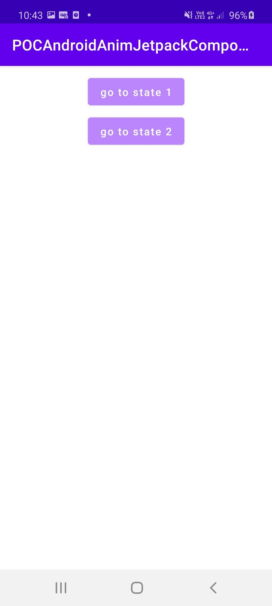
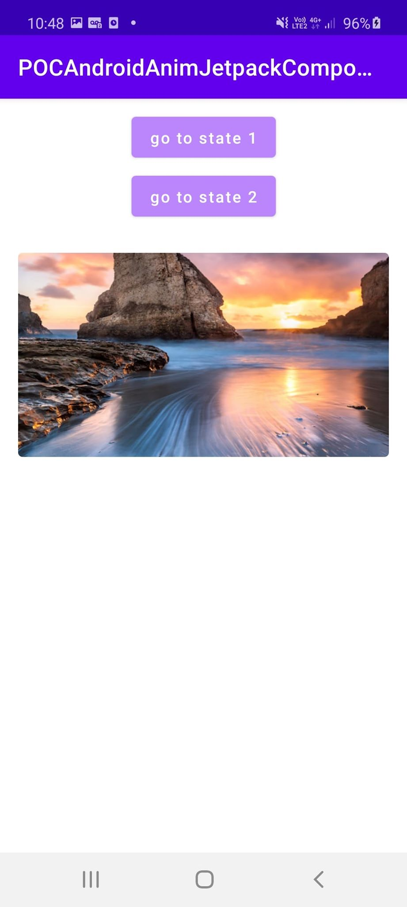
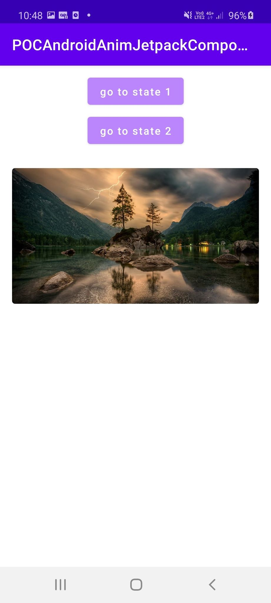

Cette animation va nous permettre de passer d'une vue à une autre. 

Je défini en en premier lieu une variable "animation" qui à pour état "A".
```kotlin
val animation = state { "A" }
```
Lorsque que l'on clique sur le bouton "go to state 1" ou "go to state 2" l'état de animation est modifié et passe à "B" ou "C".

On appel ensuite CrossFade qui va définir une vue suivant l'état de animation.
```kotlin
@Composable
    fun CrossFade () {
        val animation = state { "A" }

        Surface(color = Color.White, modifier = Modifier.fillMaxHeight().fillMaxWidth()) {
            Column(
                modifier = Modifier
                    .fillMaxHeight()
                    .fillMaxWidth()
                    .padding(bottom = 100.dp, start = 16.dp, top = 16.dp, end = 16.dp),
                horizontalGravity = Alignment.CenterHorizontally
            ) {
                Button(onClick = { animation.value = "B"}) {
                    Text(text = "go to state 1")
                }
                Button(onClick = { animation.value = "C"}, modifier = Modifier.padding(top = 16.dp)) {
                    Text(text = "go to state 2")
                }

                val myImage = imageResource(id = R.drawable.header)
                val myImage2 = imageResource(id = R.drawable.nature)
                val imageModifier = Modifier
                    .padding(top = 32.dp)
                    .preferredHeightIn(maxHeight = 180.dp)
                    .fillMaxWidth()
                    .clip(shape = RoundedCornerShape(4.dp))
                
                Crossfade(current = animation.value) { screen ->
                    when (screen) {
                        "B" -> Image(
                            asset = myImage,
                            contentScale =  ContentScale.Crop,
                            modifier = imageModifier)
                        "C" -> Image(
                            asset = myImage2,
                            contentScale =  ContentScale.Crop,
                            modifier = imageModifier)
                    }
                }
            }
        }
    }
```

## Animation Translation

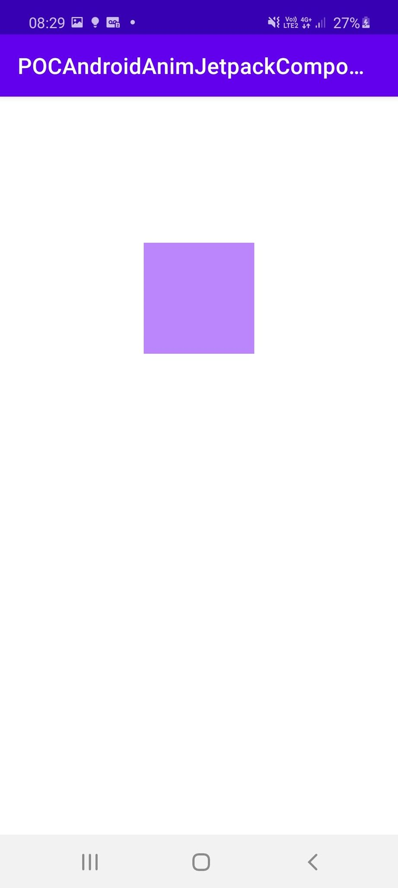

Cette animation va nous permettre de faire faire une translation vers le haut à notre objet.

Pour cela dans un premier temps on défini l'état de depart de notre objet, son état d'arrivé, et la transition entre ces deux états.
```kotlin
    enum class TranslationState {
        First,Second
    }

    val heightKey = FloatPropKey()

    val definitionTranslation = transitionDefinition {
        state(TranslationState.First) {
            this[heightKey] = 0f
        }
        state(TranslationState.Second) {
            this[heightKey] = -1000f
        }
        transition(fromState = TranslationState.First, toState = TranslationState.Second) {
            heightKey using keyframes {
                duration = 2000
            }
            interruptionHandling = InterruptionHandling.UNINTERRUPTIBLE
        }
    }
```

Ensuite je déclare une variable "animation" qui a pour état "false".
```kotlin
val animation = state { false }
```

Lorsque cette variable passe à "true" notre objet va passer de notre état 1 à notre état 2.
```kotlin
    @Composable
    fun Translation () {
        val animation = state { false }

        Surface(color = Color.White, modifier = Modifier.fillMaxHeight().fillMaxWidth()) {
            Column(
                modifier = Modifier
                    .fillMaxHeight()
                    .fillMaxWidth()
                    .padding(bottom = 100.dp, start = 16.dp, top = 16.dp, end = 16.dp),
                horizontalGravity = Alignment.CenterHorizontally,
                verticalArrangement = Arrangement.Bottom
            ) {
                Transition(definition = definitionTranslation,
                    initState = TranslationState.First,
                    toState = if (!animation.value) {
                        TranslationState.First
                    } else {
                        TranslationState.Second
                    }
                ) { state ->
                    Canvas(
                        modifier = Modifier
                            .drawLayer(translationY = state[heightKey])
                            .preferredSize(100.dp)
                            .clickable(onClick = { animation.value = animation.value != true })
                    ) {
                        drawRect(color = purple200)
                    }
                }
            }
        }
    }
```

## Evaluator Color


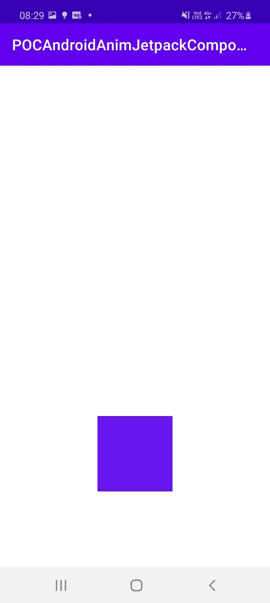

Cette animation va nous permettre de faire une interpolation entre deux couleur pendant la durée de l'animation.

Pour cela dans un premier temps on défini l'état de depart de notre objet, son état d'arrivé, et la transition entre ces deux états.
```kotlin
    enum class State {
        First,Second
    }

    val colorKey = ColorPropKey()

    val definition = transitionDefinition {
        state(State.First) {
            this[colorKey] = purple200
        }
        state(State.Second) {
            this[colorKey] = purple500
        }
        transition(fromState = State.First, toState = State.Second) {
            colorKey using keyframes {
                duration = 2000
            }
            interruptionHandling = InterruptionHandling.UNINTERRUPTIBLE
        }
    }
```

Ensuite je déclare une variable "animation" qui a pour état "false".
```kotlin
val animation = state { false }
```

Lorsque cette variable passe à "true" notre objet va passer de notre état 1 à notre état 2.
```kotlin
    @Composable
    fun EvaluatorColor() {
        val animation = state { false }

        Surface(color = Color.White, modifier = Modifier.fillMaxHeight().fillMaxWidth()) {
            Column(
                modifier = Modifier
                    .fillMaxHeight()
                    .fillMaxWidth()
                    .padding(bottom = 100.dp, start = 16.dp, top = 16.dp, end = 16.dp),
                horizontalGravity = Alignment.CenterHorizontally,
                verticalArrangement = Arrangement.Bottom
            ) {
                Transition(definition = definition,
                    initState = State.First,
                    toState = if (!animation.value) {
                        State.First
                    } else {
                        State.Second
                    }
                ) { state ->
                    Canvas(
                        modifier = Modifier
                            .preferredSize(100.dp)
                            .clickable(onClick = { animation.value = animation.value != true })
                    ) {
                            drawRect(color = state[colorKey])
                    }
                }
            }
        }
    }
```

