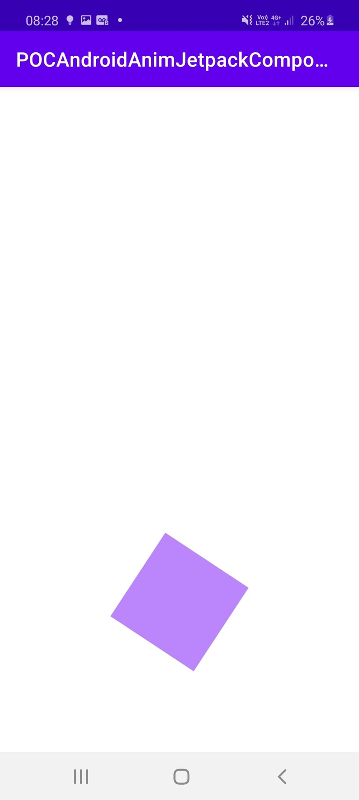

# PocAndroidAnimJetpackCompose

Dans ce projet j'explore comment effectuer des animations sur jetpack Compose

## Home Page


## Rotate



Cette animation va nous permettre de faire faire une rotation à notre objet.

Pour cela dans un premier temps on défini l'état de depart de notre objet, son état d'arrivé, et la transition entre ces deux états.

```kotlin
    enum class Rotation {
        First,Second
    }

    val rotation = FloatPropKey()

    val definitionRotation = transitionDefinition {
        state(Rotation.First) {
            this[rotation] = 0f
        }
        state(Rotation.Second) {
            this[rotation] = 360f
        }
        transition(fromState = Rotation.First, toState = Rotation.Second) {
            rotation using repeatable {
                animation = tween {
                    easing = FastOutLinearInEasing
                    duration = 2000
                }
                iterations = 1
            }
        }
    }
```

Ensuite je déclare une variable qui a pour état "false". Lorsque cette variable passe à true notre objet va passer de notre état 1 à notre état 2.

```kotlin
@Composable
    fun Rotate() {
        val animation = state { false }

        Surface(color = Color.White, modifier = Modifier.fillMaxHeight().fillMaxWidth()) {
            Column(
                    modifier = Modifier
                        .fillMaxHeight()
                        .fillMaxWidth()
                        .padding(bottom = 100.dp, start = 16.dp, top = 16.dp, end = 16.dp),
                    horizontalGravity = Alignment.CenterHorizontally,
                    verticalArrangement = Arrangement.Bottom
            ) {
                Transition(definition = definitionRotation,
                        initState = Rotation.First,
                        toState = if (!animation.value) {
                            Rotation.First
                        } else {
                            Rotation.Second
                        }
                ) { state ->
                    Canvas(
                            modifier = Modifier.preferredSize(100.dp).clickable(onClick = { animation.value = true })
                    ) {
                        rotate(state[rotation]) {
                            drawRect(color = purple200)
                        }
                    }
                }
            }
        }
    }
```
